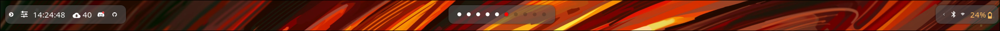

# Hyperland Configuration by Calcyffer

Here is my first Hyperland Configuration with my favorite keyboard and tweaks.

# Waybar

Orginaly from https://github.com/elifouts/Dotfiles but modify for my use

# Hyprland

## Hyprland Keybinds

### **Window Management**

`Mod + Enter` - Open terminal

`Mod + Q `- Kill active window

`Mod + M` - Exit Hyprland

`Mod + V` - Toggle floating

`Mod + P` - Toggle pseudo mode (dwindle)

`Mod + J` - Toggle split direction (dwindle)

### **Applications**

`Mod + N` - Open file manager

`Mod + D` - Open application menu

### **System**
`Mod + L` - Lock screen (hyprlock)

`Mod + Print` - Take screenshot of selected region

# Content

- hyprland.conf — Core configuration for Hyprland: defines window layouts, keybindings, animations, gaps, and color schemes.

- hyprlock.conf — Lock screen configuration using Hyprlock: custom visuals, clock display, and unlock method.

- hypridle.conf — Idle behavior setup: locks the session after a defined period of inactivity via Hypridle.

- hyprpaper.conf — Wallpaper management configuration using Hyprpaper: sets background images and defines per-monitor wallpapers.

- waybar — Custom status bar configuration for Wayland: includes modules for workspaces, CPU, RAM, battery, clock, network, and more — styled to match the overall theme. Supports clickable modules and integration with Hyprland workspaces.

## Disclamers

Since my keyboard is in french, you will need to change some paramaters in hyprland.conf

at line 204, change the kb_layout to your own

    kb_layout = fr

For the Workspace change the second parameters after the equal to correspond with your keyboard layout

    # Switch workspaces with mainMod + [0-9]
    bind = $mainMod, ampersand, workspace, 1
    bind = $mainMod, eacute, workspace, 2
    bind = $mainMod, quotedbl, workspace, 3
    bind = $mainMod, apostrophe, workspace, 4
    bind = $mainMod, parenleft, workspace, 5
    bind = $mainMod, minus, workspace, 6
    bind = $mainMod, egrave, workspace, 7
    bind = $mainMod, underscore, workspace, 8
    bind = $mainMod, ccedilla, workspace, 9
    bind = $mainMod, agrave, workspace, 10

    # Move active window to a workspace with mainMod + SHIFT + [0-9]
    bindl = $mainMod SHIFT, ampersand, movetoworkspacesilent, 1
    bindl = $mainMod SHIFT, eacute, movetoworkspacesilent, 2
    bindl = $mainMod SHIFT, quotedbl, movetoworkspacesilent, 3
    bindl = $mainMod SHIFT, apostrophe, movetoworkspacesilent, 4
    bindl = $mainMod SHIFT, parenleft, movetoworkspacesilent, 5
    bindl = $mainMod SHIFT, minus, movetoworkspacesilent, 6
    bindl = $mainMod SHIFT, egrave, movetoworkspacesilent, 7
    bindl = $mainMod SHIFT, underscore, movetoworkspacesilent, 8
    bindl = $mainMod SHIFT, ccedilla, movetoworkspacesilent, 9
    bindl = $mainMod SHIFT, agrave, movetoworkspacesilent, 10